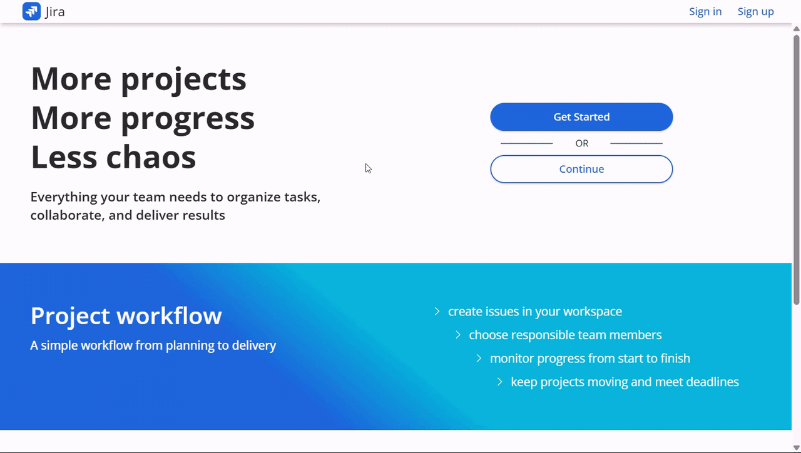
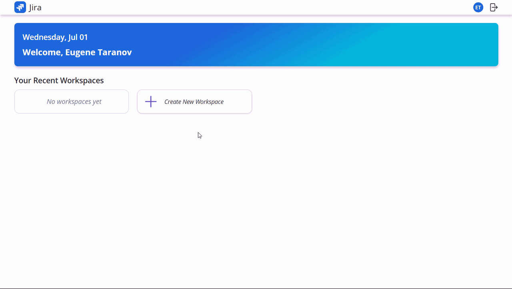
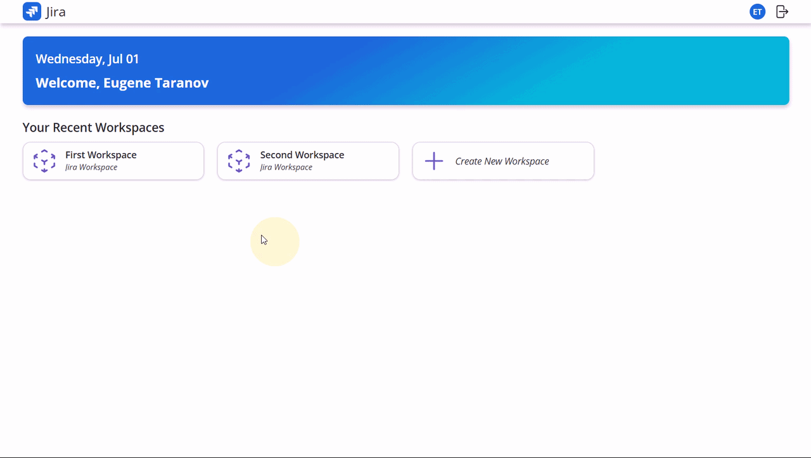
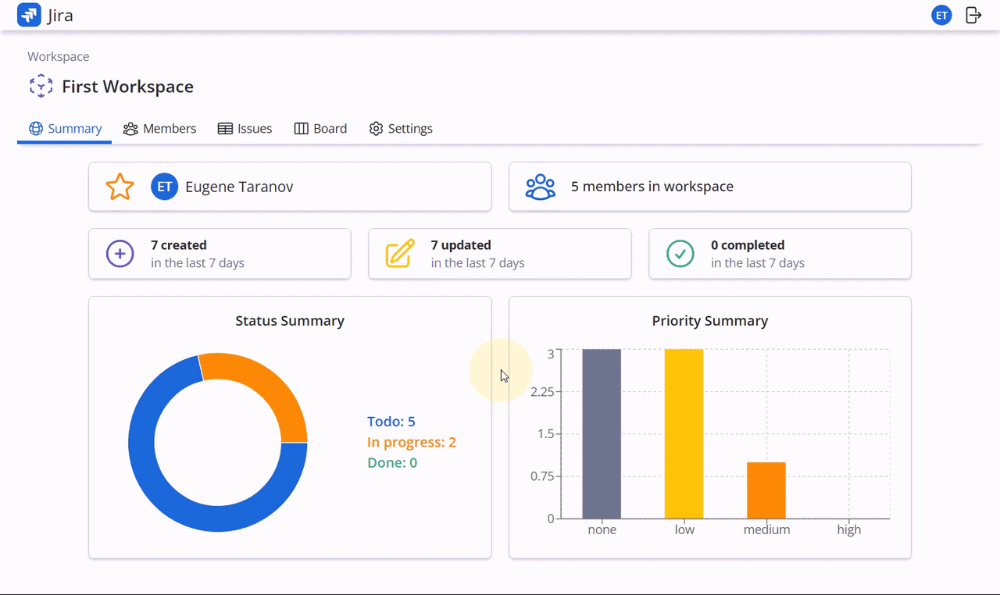
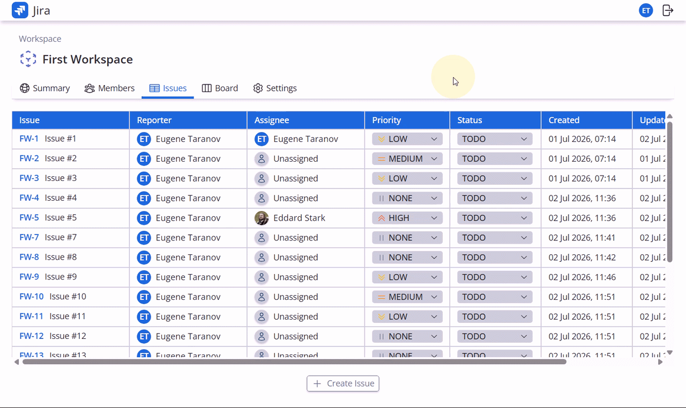
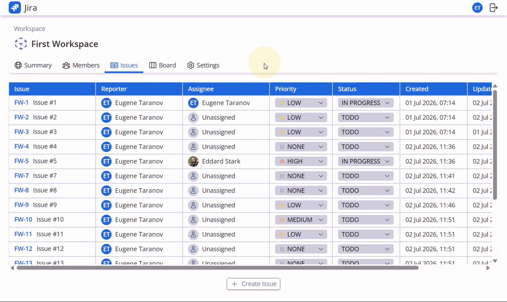
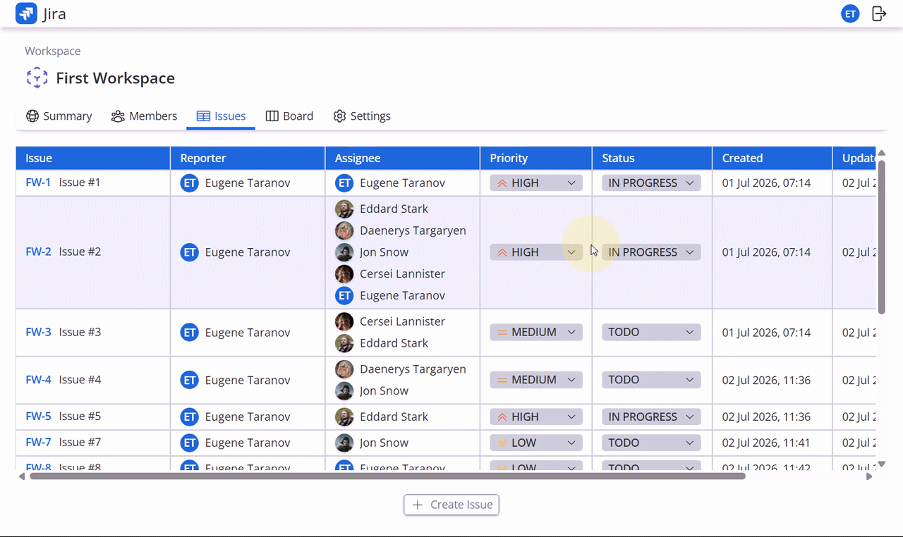
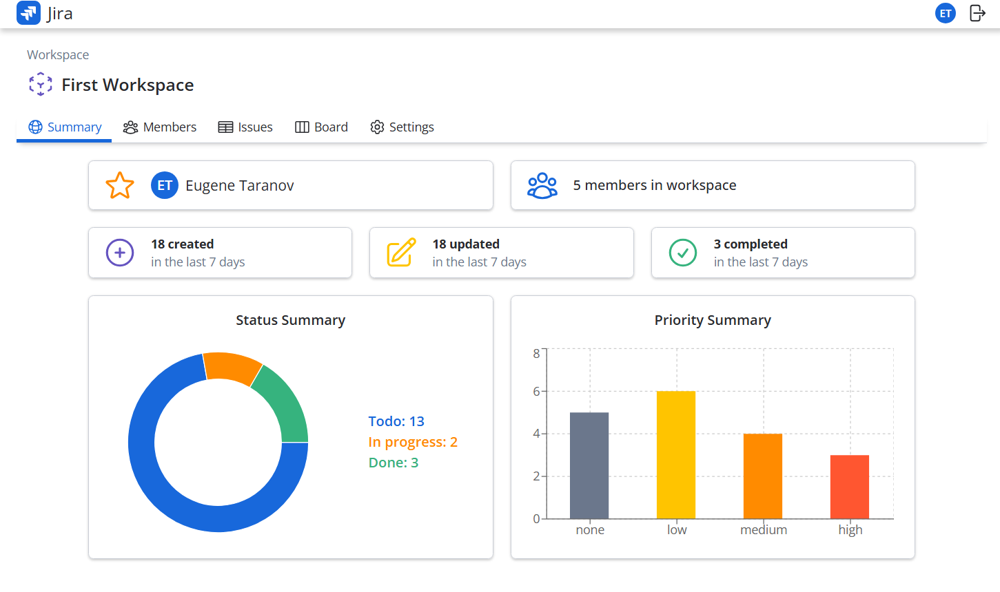

# Jira App

## Table of Contents

- [Jira App](#jira-app)
  - [Table of Contents](#table-of-contents)
  - [About the Project](#about-the-project)
    - [Project Goals](#project-goals)
    - [Technologies](#technologies)
    - [Project structure](#project-structure)
      - [Client](#client)
      - [Server](#server)
    - [REST API Endpoints](#rest-api-endpoints)
    - [Examples of the Application (GIFs and Screenshots)](#examples-of-the-application-gifs-and-screenshots)
  - [Usage](#usage)
    - [Running with Docker Compose](#running-with-docker-compose)
      - [Setup](#setup)
      - [Running the application](#running-the-application)
      - [Optional database setup](#optional-database-setup)
      - [Running tests](#running-tests)
      - [Stop the application](#stop-the-application)

## About the Project

This project is a full-stack Jira-inspired task management application built with a modern client–server architecture.

The backend is built with Node.js, Express, and MongoDB using a modular architecture and exposes a REST API. The frontend is built with React, React Router, TanStack Query, and Tailwind CSS. The codebase follows the Feature-Sliced Design (FSD) architecture.

Features:

- JWT authentication
- Workspace management
- Personal profile
- Team collaboration
- Issue management
- Kanban board with Drag & Drop
- Project statistics dashboard
- Track project progress across multiple workspaces

The application is fully dockerized using Docker and Docker Compose, providing a reproducible development environment.

### Project Goals

The primary goal of this project was to build a production-like task management application while improving practical full-stack development skills.

The project focused on:

- applying modular architecture on the backend
- implementing authentication and authorization using JWT-based access and refresh tokens with HTTP-only cookies
- working with a MongoDB database through Mongoose
- managing client state with TanStack Query
- implementing drag-and-drop interactions for the Kanban board
- building reusable and maintainable React components
- writing unit, integration, and end-to-end (E2E) tests for both client and server
- automating CI/CD pipelines with GitHub Actions
- using a Git workflow with separate main and development branches, protected branch rules, and pull requests

### Technologies

Client:

- TypeScript
- React (Hooks, Context API, Portal, etc.)
- React Query (TanStack Query)
- React libraries:
  - React Router (Declarative mode)
  - React Hot Toast
  - React Icons
- Styling: Tailwind CSS
- Validation: Zod
- Architecture: Feature-Sliced Design
- Testing: Vitest, React Testing Library
- Vite
- ESLint, Prettier

Server:

- TypeScript
- Node.js
- Express.js
- Mongoose ODM
- JWT authentication
- Validation: Zod
- Architecture: Modular
- Testing: Jest, Supertest
- Vite
- ESLint, Prettier

Database:

- MongoDB

DevOps:

- Docker
- Docker Compose
- GitHub Actions

### Project structure

#### Client

```
└───client
    ├───public/...
    ├───src
    │   ├───app
    │   │   ├───layouts/...
    │   │   ├───providers/...
    │   │   ├───routes/...
    │   │   └───styles/...
    │   ├───entities
    │   │   ├───issue/...
    │   │   ├───user/...
    │   │   └───workspace/...
    │   ├───features
    │   │   ├───addAssignee/...
    │   │   ├───addMember/...
    │   │   ├───createIssue/...
    │   │   ├───createWorkspace/...
    │   │   ├───deleteAccount/...
    │   │   ├───deleteAssignee/...
    │   │   ├───deleteIssue/...
    │   │   ├───deleteMember/...
    │   │   ├───deleteWorkspace/...
    │   │   ├───searchUsers/...
    │   │   ├───signIn/...
    │   │   ├───signOut/...
    │   │   ├───signUp/...
    │   │   ├───updateAvatar/...
    │   │   ├───updateBio/...
    │   │   ├───updateIssueDescription/...
    │   │   ├───updateIssuePriority/...
    │   │   └───updateIssueStatus/...
    │   ├───pages
    │   │   ├───account
    │   │   │   ├───bio/...
    │   │   │   ├───issues/...
    │   │   │   └───settings/...
    │   │   ├───app
    │   │   │   ├───home/...
    │   │   │   └───workspace
    │   │   │       ├───board/...
    │   │   │       ├───issues/...
    │   │   │       ├───members/...
    │   │   │       ├───settings/...
    │   │   │       └───summary/...
    │   │   ├───auth
    │   │   │   ├───signin/...
    │   │   │   └───signup/...
    │   │   ├───home/...
    │   │   └───profile/...
    │   ├───shared
    │   │   ├───api/...
    │   │   ├───assets/...
    │   │   ├───context/...
    │   │   ├───hooks/...
    │   │   ├───test/...
    │   │   ├───types/...
    │   │   ├───ui
    │   │   │   ├───Dropdown/...
    │   │   │   ├───Form/...
    │   │   │   ├───Modal/...
    │   │   │   ├───Skeleton/...
    │   │   │   └───Table/...
    │   │   └───utils/...
    │   ├───widgets
    │   │   ├───AccountBio/...
    │   │   ├───AccountIssues/...
    │   │   ├───AccountSettings/...
    │   │   ├───Board/...
    │   │   ├───IssueDetails/...
    │   │   ├───Issues/...
    │   │   ├───Members/...
    │   │   ├───Profile/...
    │   │   ├───Settings/...
    │   │   ├───Summary/...
    │   │   └───Workspaces/...
    │   └───main.tsx
    └───index.html
```

#### Server

```
└───server
    ├───public
    │   └───images
    │       └───avatars/...
    ├───src
    │   ├───@types/...
    │   ├───modules/...
    │   │   ├───auth/...
    │   │   ├───issue/...
    │   │   ├───user/...
    │   │   └───workspace/...
    │   ├───shared/...
    │   │   ├───errors/...
    │   │   ├───middleware/...
    │   │   ├───model/...
    │   │   ├───types/...
    │   │   └───utils/...
    │   └───tests/...
    ├───app.ts
    ├───router.ts
    └───server.ts
```

### REST API Endpoints

> [!NOTE]
> Abbreviation for roles:
>
> - M = workspace member
> - R = current issue reporter (workspace member)
> - O = workspace owner

| Method | URL                                        | Authorized | Roles |
| :----: | :----------------------------------------- | :--------: | :---: |
|  GET   | /api/v1/auth/me                            |     ✅     |   -   |
|  GET   | /api/v1/auth/refresh                       |     ❌     |   -   |
|  POST  | /api/v1/auth/signin                        |     ❌     |   -   |
|  POST  | /api/v1/auth/signup                        |     ❌     |   -   |
|  POST  | /api/v1/auth/signout                       |     ✅     |   -   |
|  GET   | /api/v1/issues                             |     ✅     |   -   |
|  GET   | /api/v1/issues/me                          |     ✅     |   -   |
|  GET   | /api/v1/issues/:issueId                    |     ✅     |   -   |
|  POST  | /api/v1/issues                             |     ✅     |  M O  |
| PATCH  | /api/v1/issues/:issueId/title              |     ✅     |  R O  |
| PATCH  | /api/v1/issues/:issueId/description        |     ✅     |  R O  |
| PATCH  | /api/v1/issues/:issueId/status             |     ✅     |  R O  |
| PATCH  | /api/v1/issues/:issueId/priority           |     ✅     |  R O  |
|  PUT   | /api/v1/issues/:issueId/assignee           |     ✅     |  R O  |
| DELETE | /api/v1/issues/:issueId/assignee           |     ✅     |  R O  |
| DELETE | /api/v1/issues/:issueId                    |     ✅     |  R O  |
|  GET   | /api/v1/users/search                       |     ✅     |  M O  |
|  GET   | /api/v1/users/:userId                      |     ✅     |  М O  |
| PATCH  | /api/v1/users/avatar                       |     ✅     |   -   |
| PATCH  | /api/v1/users/bio                          |     ✅     |   -   |
| DELETE | /api/v1/users                              |     ✅     |   -   |
|  GET   | /api/v1/workspaces                         |     ✅     |  M O  |
|  GET   | /api/v1/workspaces/:workspaceId/statistics |     ✅     |  M O  |
|  GET   | /api/v1/workspaces/:workspaceId            |     ✅     |  M O  |
|  POST  | /api/v1/workspaces                         |     ✅     |   -   |
| PATCH  | /api/v1/workspaces/:workspaceId            |     ✅     |   O   |
|  PUT   | /api/v1/workspaces/:workspaceId/member     |     ✅     |   O   |
| DELETE | /api/v1/workspaces/:workspaceId/member     |     ✅     |   O   |
| DELETE | /api/v1/workspaces/:workspaceId            |     ✅     |   O   |

### Examples of the Application (GIFs and Screenshots)

Home page and user sign-in:



Create multiple workspaces for further work with them:



Adding new members to a workspace for team collaboration on a project:



Creating a new issue:



Issues table. You can view basic information about issues, create or delete issues, and easily update status or priority of an issue:



Issue details. You can update all issue details and assign (or unassign) team members to work on the issue:



Kanban board with drag-and-drop support for tracking issue progress:



Workspace statistics:



## Usage

### Running with Docker Compose

#### Setup

Requirements:

- Docker
- Docker Compose
- `.env` file
- Ports `:8080` and `:3000` must be available

#### Running the application

From the project root:

```
docker compose up -d --build
```

> [!TIP]
> Once the Docker containers are running, the application is available at `http://localhost:3000/`

#### Optional database setup

Restore the demo database:

```
docker cp ./database mongo:/database
```

and

```
docker exec -it mongo mongorestore --username root --password 1111 --authenticationDatabase admin --db jira /database/jira
```

#### Running tests

Run server tests:

```
docker exec -it server npm run test
```

Server test coverage:

```
docker exec -it server npm run test:coverage
```

Run client tests:

```
docker exec -it client npm run test
```

Client test coverage:

```
docker exec -it client npm run test:coverage
```

#### Stop the application

```
docker compose down
```
